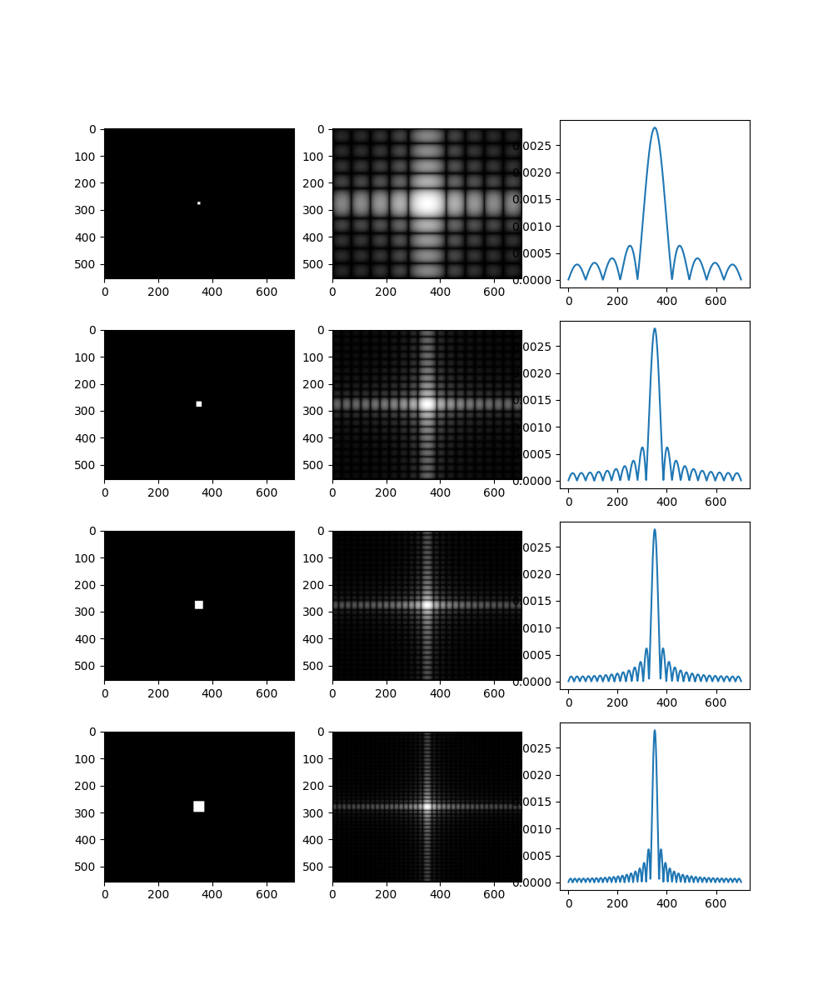

<h2>滤波、平滑和降噪</h2>

**滤波是手段、平滑是效果、降噪是目的**（通常来说）

0. 图像中的“磨皮”“朦胧”“降噪”本质上都是让图像变得平滑，原理是——用某一点的像素灰度和周围像素的灰度值取加权平均，替代原本的像素灰度。相当于削高补低。而在一维信号中我们采用构造一个低通滤波器去掉高频分量来降噪。那么平滑和滤波有什么关系？

1. 图像处理中的平滑

- 均值平滑

- 高斯平滑

2. 能否对一维信号做平滑？滑动平均和卷积的关系？

- 一维的平均滑动窗相当于一维向量$\frac{1}{N}\left[\begin{matrix}0&0&\cdots&1&1&\cdots&1&\cdots&0 \end{matrix}\right]$，也就是矩形窗

- 每次把这个窗函数向右平移n个单位，和原来的信号相乘再求和，等到结果信号的第n个点的值

  

卷积与平滑结果几乎一致

3. 平滑和低通滤波有什么关系？

- 通过滑动平均法做平滑的操作其实就是卷积的过程，只不过卷积要先翻褶（实际上滑动平均的过程应该叫做协相关）

$$
\text{卷积}\,\,\,f(n)\otimes g(n) = \sum_{m=-\infty}^{\infty}f(m)g(n-m)\\
g(m)\rightarrow g(-m) \rightarrow g(n-m)
\\\\
\text{协相关}\,\,\, R_{fg}(n) = \sum_{m=-\infty}^{\infty}f(m)g^{*}(m-n)
= \sum_{m=-\infty}^{\infty}f(m)g(m-n)
\\
g(m)\rightarrow g^*(m-n)\rightarrow g(m-n)
\\\\
\text{两者的关系}\,\,\,R_{fg} (n) = f(n)\otimes g^{*}(-n)
$$

- 平滑和卷积是一样的，卷积相当于频谱相乘，所以平滑的结果也是频谱相乘

- 在二维中卷积核可以理解为$g(x_n,y_n)$，原始图像$f(x_n^,,y_n^,)$，根据二维傅里叶变换在时域和频域的对偶关系
  $$
  g(x,y)\otimes f(x,y)\rightarrow G(u,v)\,\mathring\, \,F(u,v)\\
  \mathring\,\,\,\text{表示矩阵按元素相乘}
  $$
  以均值滤波为例，将卷积核做傅里叶变换。根据二维DFT，相当于在无穷大的（u，v）二维频率空间中用二维的Sa函数截取最中间（低频）的部分

​		
$$
G(u,v) = \sum_{x=0}^{M-1}\sum_{y=0}^{N-1}g(x,y)e^{-j2\pi (\frac{ux}{M}+\frac{vy}{N})}\,\,\,when\,\,\,g(x,y)=\frac{1}{MN}\\\\
=\frac{1}{MN}
\left[\begin{matrix}
\,1 & e^{j\frac{2\pi}{M}u} & \cdots &e^{j\frac{2\pi}{M}(M-1)u}
\end{matrix}
\right]\cdot\,
\left[\begin{matrix}
\sum_{y=0}^{N-1}e^{-j2\pi\frac{vy}{N}}\\
\sum_{y=0}^{N-1}e^{-j2\pi\frac{vy}{N}}\\
\vdots\\
\sum_{y=0}^{N-1}e^{-j2\pi\frac{vy}{N}}
\end{matrix}
\right]
\\\\
=\frac{1}{MN}\sum_{x=0}^{M-1}e^{j2\pi\frac{ux}{M}}\cdot\sum_{y=0}^{N-1}e^{j2\pi\frac{vy}{N}}
\\\\
\text{频谱中的每一点相当于对图像的一行做FFT，再对一列做FFT，然后相乘}\\
\text{由于一行和一列都是矩形窗函数，结果相当于两个正交的的Sa函数相乘}
$$

从矩形变化到Sa函数不太好检验，干脆从Sa函数反变换回矩形函数

左图是对Sa(2x)在 $x\in[-2,2]$上做20点的采样（频谱采样），右图是IFFT的结果，边缘很锋利，应该是矩形函数

如果使用Sa函数卷积核，则相当于用矩形框来截取最低频率

​		

卷积核的尺寸增大，对于平滑滤波有什么效果？

- 以均匀滤波为例
- 当核的尺寸趋于0，对于一维信号，相当于原信号卷积冲击串；对于二维图像，相当于每个像素点乘以单位1，信号和图像无变化
- 当核的尺寸在0和原始信号（图像）尺寸之间时，随着核尺寸的增大，平滑的效果更加明显；当两者尺寸相同时达到极限

3. 想法验证

- 我们有一张小白兔的图片

- 图像的傅里叶变换和还原

频谱中心频率低，外围频率高，左右半边中心对称。对称亮点的连线的垂线方向代表亮度变化方向

- 验证卷积定理

$$
使用如下卷积核:\\\left[\begin{matrix}
0.04 & 0.04 & 0.04 & 0.04 & 0.04\\
0.04 & 0.04 & 0.04 & 0.04 & 0.04\\
0.04 & 0.04 & 0.04 & 0.04 & 0.04\\
0.04 & 0.04 & 0.04 & 0.04 & 0.04\\
0.04 & 0.04 & 0.04 & 0.04 & 0.04\\
\end{matrix}\right]
$$

在做FFT的时候使用的是和图像大小相同的0矩阵，将卷积核放在中间（相当于卷积核外围补零）

原图像和补零后的卷积核分别FFT然后相乘，再IFFT回来

​						频谱图并不一样，仔细检查后发现是卷积函数添加了参数，导致边缘没有变化

​						修改参数后几乎一致了

​								根据我们的推论，滤波后的频谱出现网格状代表了Sa函数，做一个验证

卷积核太小的时候看不出来函数形状，所以逐步扩大卷积核，结果如下图

其中右边的曲线取自中间频谱的中间水平线

实际上这是Sa函数的绝对值

- 逐渐扩大卷积核

- 加噪与降噪

  

可以看到经典的滑动平均方法虽然能起到平滑的效果，但是图片本身也模糊了很多。使用非经典的中值滤波方法降噪效果会好很多。

*中值滤波就是在卷积核的范围内的点中选取所有值的中值而不是平均值，来代替结果。这意味着不能通过转换到频域，而只能采用滑动窗口方法*

4. 高通滤波（锐化）

如果只关心物体的边界，可以采用高通滤波

5. 参考资料
   1. [【数字图像处理】灰度图像中添加高斯噪声、椒盐噪声、斑点噪声以及利用不同方法（中值、排序、维纳滤波）去除各种噪声的matlab程序](https://blog.csdn.net/qq_59049513/article/details/122598641)
   2. [几种常用信号平滑去噪的方法（附Matlab代码）](https://blog.csdn.net/weixin_42943114/article/details/107693068)
   3. [SciPy - 滤波 与 图像去噪 ](https://www.cnblogs.com/yanshw/p/11170841.html)
   4. [频率域图像增强](https://blog.csdn.net/baidu_39044178/article/details/81231413?utm_medium=distribute.pc_aggpage_search_result.none-task-blog-2~aggregatepage~first_rank_ecpm_v1~rank_v31_ecpm-10-81231413-null-null.pc_agg_new_rank&utm_term=%E5%9B%BE%E5%83%8F%E5%B9%85%E5%BA%A6%E4%B8%8E%E9%A2%91%E7%8E%87%E5%9B%BE%E5%83%8F&spm=1000.2123.3001.4430)
   5. [关于平滑处理及图像滤波与滤波器](https://www.cnblogs.com/zhuifeng-mayi/p/9558052.html)
   6. [[CV] 通俗理解『卷积』——从傅里叶变换到滤波器](https://zhuanlan.zhihu.com/p/28478034)
   7. [matlab图像滤波详解（二维傅里叶滤波）](https://blog.csdn.net/yuanhoushu/article/details/123893083)
   8. [图像傅里叶变换](https://wenku.baidu.com/view/cb37abc8e309581b6bd97f19227916888486b9c2.html)
   9. [图像处理入门——傅里叶变换](https://zhuanlan.zhihu.com/p/452230294)
   9. [“相关”与“卷积”的理解和使用](http://www.360doc.com/content/17/0925/20/908538_690127117.shtml)

6. 代码与文档地址：[Signal](https://github.com/ZHUyu20020601/Signal)
